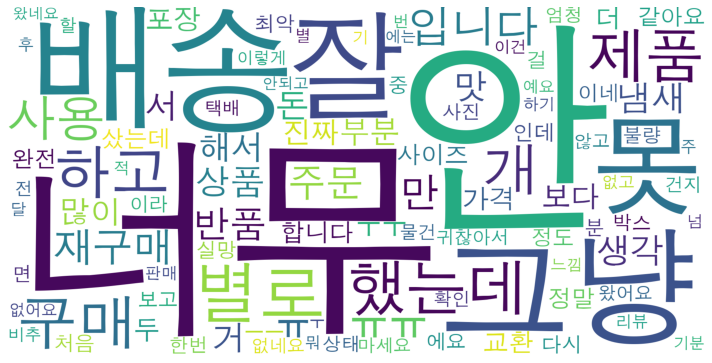
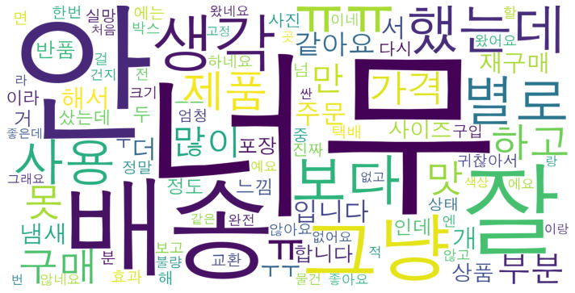
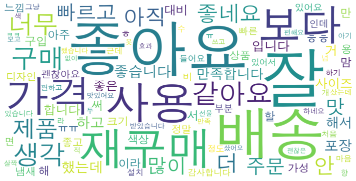
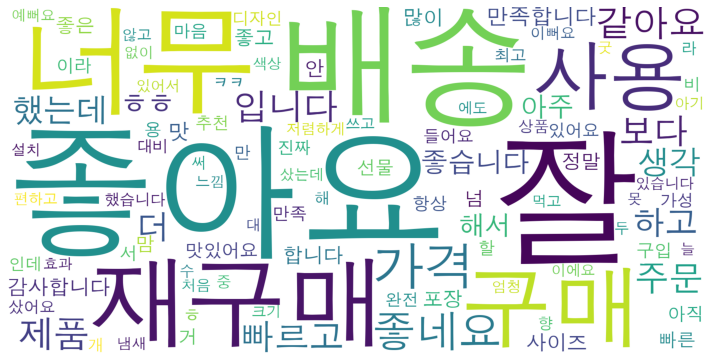
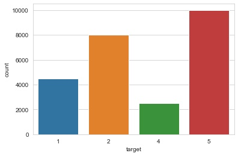
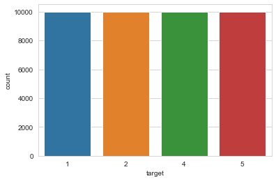
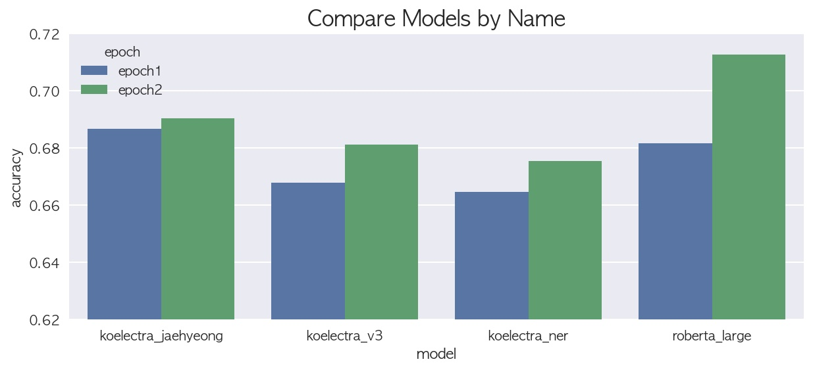
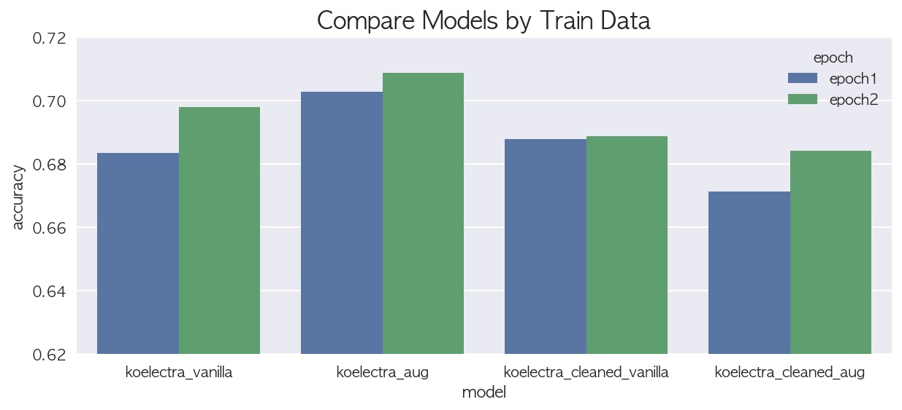
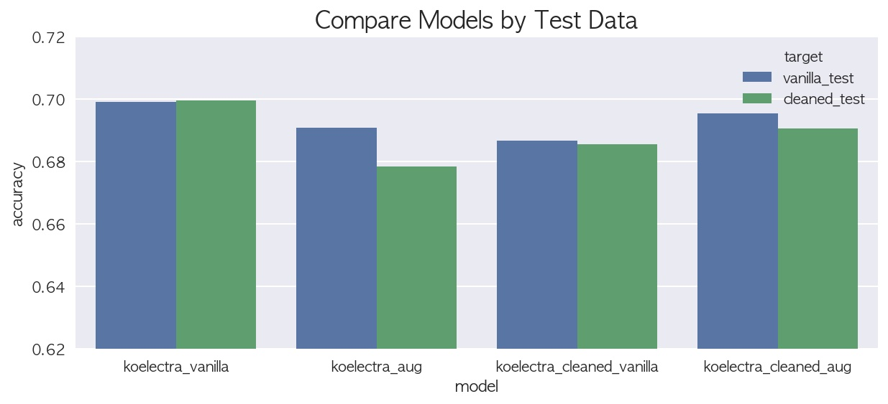
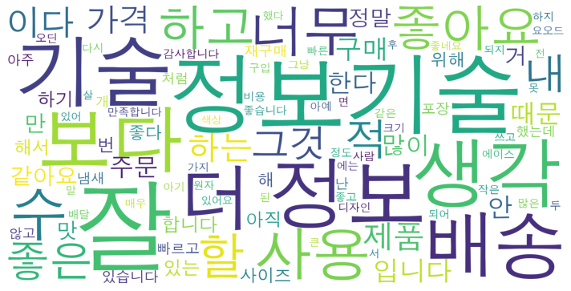

# [쇼핑몰 리뷰 평점 분류 경진대회](https://dacon.io/competitions/official/235938/codeshare/5932)
- [Introduction](#introduction)
- [Data](#data)
- [EDA](#eda)
- [Data Augmentation](#data-augmentation)
- [Experiments](#experiments)
- [Conclusion](#conclusion)
- [Post-Project](#post-project)

---

## Introduction

- 쇼핑몰에서 상품을 고르는데 있어서 다른 사람들의 리뷰와 평점을 참고하게 되는데,   
상품 리뷰 텍스트와 평점 사이에 어떤 관계가 있는지, 리뷰 텍스트만으로 평점을 예측가능한지에 대해 실험
- 1점, 2점, 4점, 5점으로 분류된 평점 별로 워드 클라우드를 활용해 빈도수가 많은 단어를 시각화해보고,   
다중 분류 작업을 수행하는 언어 모델을 학습시킨 결과를 비교할 계획으로 프로젝트 진행
- 평점 별 불균형이 존재해 F1-Score로 평가하는 것이 이상적이라 판단하지만,   
대회의 판단 기준에 맞게 Accuracy를 활용하고, 전체 테스트 데이터 중 50%에 대한 점수를 지표로 활용
- Fine-tuning된 KoELECTRA 및 RoBERTa 모델에 대한 예측 결과를 hard-voting하여   
accuracy 기준 `0.7116` 점으로 550팀 중 2위에 위치

---

## Data

- [쇼핑몰 리뷰 데이터](https://dacon.io/competitions/official/235938/data)
- 샘플 아이디(id), 쇼핑몰 리뷰 텍스트(reviews), 상품 평점(target)으로 구성
- 총 25000개의 행에 대해서, 각각의 리뷰 텍스트에 1, 2, 4, 5 중 하나의 평점이 라벨링된 구조

---

## EDA

- 토큰화된 단어를 워드 클라우드로 시각화 했을 때, 낮은 평점의 리뷰에서는 '안'과 같은 부정적인 단어가,   
높은 평점의 리뷰에서는 '잘', '좋아요'와 같은 긍정적인 단어가 자주 언급됨을 확인
- '재구매' 단어 역시 높은 평점의 리뷰에서 더욱 많은 비중을 가지고 있으며,   
'배송' 단어의 경우 모든 평점의 리뷰에서 유사한 비중을 가짐

|평점 1점 리뷰에서 빈도수가 많은 단어|평점 2점 리뷰에서 빈도수가 많은 단어|
|:-:|:-:|
|||

|평점 4점 리뷰에서 빈도수가 많은 단어|평점 5점 리뷰에서 빈도수가 많은 단어|
|:-:|:-:|
|||

- 평점 별 리뷰 수를 시각화 했을 때, 최대 4배에 달하는 불균형이 존재함을 확인
- 데이터 증강을 통해 각 평점 간 비율을 맞춰야할 것이라 판단

|원본 데이터의 불균형적인 평점 별 리뷰 수|이상적인 평점 별 리뷰 수|
|:-:|:-:|
|||

---

## Data Augmentation

### Reverse Translation

- 한글 리뷰를 영어로 번역하고 다시 한글로 역번역하여 의미의 변질없이 문장의 표현만을 변환
- 초기엔 구글 번역 API를 구현한 googletrans 라이브러리로 번역을 시도했지만,   
'별로'를 'good'으로 변환하는 등 핵심 키워드에 대한 번역이 올바르지 못해 다른 방안을 탐색
- 다음으로, 파파고 크롤링을 활용했을 때, 구글 번역보다 상대적으로 정확도가 높았지만,   
단어 번역을 시도하고 결과를 수집하는데 평균 3초의 딜레이가 요구되어 시간적 손실이 큼
- 결과적으로, 요청 비용이 발생하는 파파고 API를 통해 역번역을 수행하지만,   
크레딧을 활용해 비용을 최소화하고, 크레딧을 초과하는 데이터에 한해 파파고 크롤링을 적용

### NLPAUG

- 역번역을 통한 2배의 증가로도 평점 별 리뷰 비율을 맞출 수 없기 때문에,   
추가적인 텍스트 증강 기법으로 NLPAUG의 동의어 변환 함수를 활용
- 'red apple'을 'ruby apple'로 대체하는 식으로 문장의 표현을 변환
- 하지만, NLPAUG에서 지원되는 WordNet에 한국어 동의어 데이터가 존재하지 않기 때문에,   
해당 기법을 적용하기 위해선 영어로 번역된 문장을 활용해야 함
- 평점 5점과 2배 이상의 차이를 보이는 1점과 4점 리뷰에 한해 역번역 전에 NLPAUG를 적용

### hanspell

- 데이터에 정규 표현식과 hanspell 맞춤법 검사를 적용해 텍스트 정규화 작업 수행
- 최종적으로 원본 데이터, 증강된 데이터, 각각에 대해 정규화된 데이터의 4가지 학습 데이터를 생성

---

## Experiments

### 서로 다른 모델 간 비교

- 학습 시간의 단축을 위해 ELECTRA 모델을 중심적으로 비교를 시도하였으며,   
대회에서 레퍼런스로 공유된 RoBERTa 모델을 비교 대상에 추가
- 한국어를 지원하는 KoELECTRA 모델 중에서 가장 기본적인 v3 모델과   
NER 작업에 사용되는 ner 모델, 다른 제작자가 감정 분석에 맞게 fine-tuning한 jaehyeong 모델,   
마지막으로 RoBERTa Large 모델을 선정하였고, 동일한 설정으로 2 epoch를 학습한 결과를 비교
- Base 모델은 64, Large 모델엔 32 batch size를 적용하였고(Colab RAM 제한),   
valid size 0.1, learning rate 1e-5 설정에 대해 2 epochs를 수행하여 accuracy를 평가
- 파라미터 수 때문이지 검증 데이터에 대한 평가 점수에서는 RoBERTa 모델이 앞섰지만,   
대회용 테스트 데이터에 대해서는 KoELECTRA jaehyeong 모델과 RoBERTa 모델의 성능이 유사

### 학습 데이터 간 비교

- 앞선 작업에서 KoELECTRA 모델과 RoBERTa 모델 간 성능 차이가 극심하지 않은 것을 확인하고,   
KoELECTRA 모델 중 가장 성능이 높은 jaehyeong 모델을 기준으로 학습 데이터 간 비교 수행
- 원본 데이터(vanilla), 증강된 데이터(aug), 정규화된 원본 데이터(cleaned_vanilla),   
정규화된 증강 데이터(cleaned_aug)를 각각 활용해 학습한 결과를 비교
- 하이퍼파라미터는 앞선 작업과 동일하며, 2 epochs를 수행하여 accuracy를 평가
- 검증 데이터에 대한 평가 점수는 aug 데이터가 앞섰지만,   
대회용 테스트 데이터에 대해서는 aug 데이터의 예측 성능이 가장 낮고 vanilla 데이터가 가장 높음

### 테스트 데이터 간 비교

- 서로 다른 학습 데이터에 대해 최적화된 모델 간에 테스트 데이터 별 예측 성능을 비교
- 테스트 데이터는 원본 데이터(vanilla)와 정규화된 데이터(cleaned)로 정의
- 전체 테스트 데이터 중 50%에 대한 점수를 기록하는 대회의 평가 기준을 활용해   
각각의 예측 결과 간에 점수를 비교했을 때, 오히려 원본 데이터가 높은 성능을 보이는 것을 확인

- 이러한 결과가 발생한 원인을 파악하기 위해 각각의 데이터에 대해 EDA를 다시 수행했을 때,   
가장 많은 데이터 증강이 발생한 평점 4점 리뷰의 단어 비율이 크게 변화함을 확인

|원본 데이터에서 평점 4점 리뷰의 단어 비율|증강/정규화된 데이터에서 평점 4점 리뷰의 단어 비율|
|:-:|:-:|
|||

- NLPAUG의 동의어 변환이 원인인 것으로 추정되어 다른 증강법을 적용할 필요가 있지만,   
데이터 전처리부터 다시 수행하는 것과 모델링을 개선하는 것을 병행할만한 여유가 없다고 판단해   
더이상의 데이터 변환 없이 다음 단계인 앙상블로 전환

### Ensemble
- KoELECTRA, RoBERTa 모델과 다양한 종류의 데이터를 활용해 예측한 결과를 통해   
hard-voting 및 soft-voting 수행
- 원본 데이터를 활용해 학습한 KoELECTRA, RoBERTa 모델의 예측값에 hard-voting을 적용한   
결과가 가장 높은 점수를 보였으며, soft-voting은 상대적으로 낮은 점수를 보임

---

## Conclusion
- 라벨 간 불균형을 극복하기 위해 역번역, 동의어 변환 등의 다양한 자연어 데이터 증강 기법을 적용
- 각각의 ELECTRA 모델과 RoBERTa Large 모델을 비교했을 때,   
파라미터의 수가 가장 많은 RoBERTa 모델의 성능이 앞섰지만 ELECTRA 모델과의 차이가 크지는 않음
- 모델 경량화를 고려할 경우엔 ELECTRA를 활용하는게 더 유리할 것
- 데이터에 따른 성능 변화를 비교하는 과정에서 전처리된 데이터가 원본 데이터보다 낮은 성능을   
발생시키는 것을 인지하고 두 데이터를 비교하였을 때 잘못된 전처리로 인해 노이즈가 발생한 것을 확인
- 텍스트 정규화를 수행한 경우가 그렇지 않은 경우보다 낮은 성능을 보이는 경향이 있었고,   
이를 통해 비정규화된 텍스트에서 나타나는 말투나 이모티콘 등의 표현이   
감정 분석 작업에 적지 않은 영향을 주는 것이라 추측

---

## Post-Project
- 자연어 처리에서 활용되는 데이터 증강 기법에 대해 알아볼 수 있는 좋은 기회가 됨
- ELECTRA 모델을 활용한 덕분에 짧은 시간 안에 다양한 조건에서 성능을 평가할 수 있었고,   
분류 작업 파이프라인을 만드는 과정에서 HuggingFace의 활용법에 대해서도 익힐 수 있게 됨
- 하지만, HuggingFace의 경우 너무 간략화된 부분이 많아 PyTorch를 배운다는 목적에는 부합하지 않았고,   
Dropout과 같은 과적합 방지 기법들을 적용하는데도 어려움을 겪음
- 고수준의 라이브러리는 사용하기엔 편리하지만 작업의 복잡도가 증가할수록 제약이 많아짐을 느꼈고,   
이를 극복하기 위해 바닥부터 모델링 코드를 짜는 경험의 중요성을 다시 한번 인식함
